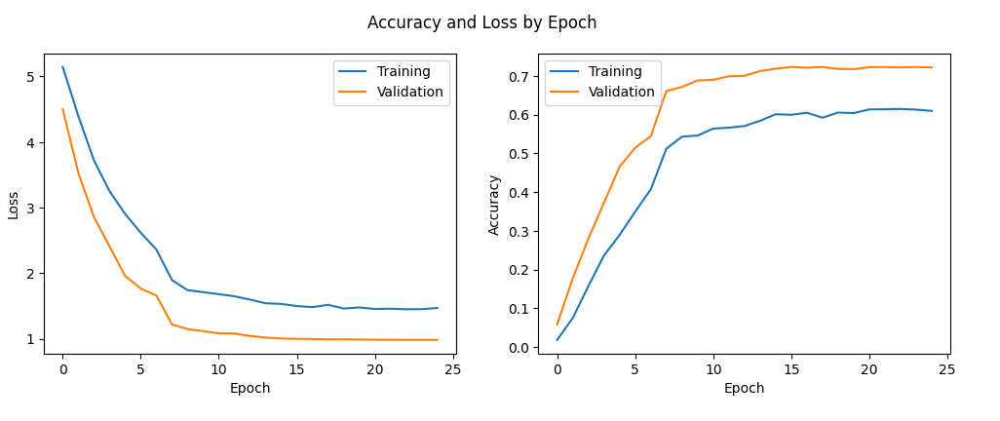

# Car Classification with Pretrained VGG16

This repository implements an image classification project using a pretrained Convolutional Neural Network (VGG16) to classify car images from the Stanford Cars dataset. The task involves training, validating and testing a supervised machine learning model, with visualizations of accuracy and loss metrics.


## Dataset

The dataset used in this project is the Stanford Cars Dataset. It includes:
- **Training Images**: High-resolution car images for model training.
- **Validation Images**: A split of the training data for model validation.
- **Testing Images**: Separate images for final evaluation.


## Model

The model is based on a pretrained **VGG16** architecture:
- **Pretrained on**: ImageNet dataset.
- **Modification**: The final fully connected layer is replaced to classify car images into 196 classes.


## Results

### Training and validation metrics

The model was trained for 25 epochs, and the training process was evaluated based on accuracy and loss. The following plots illustrate the results:


- Loss: The training and validation loss decreased steadily, indicating effective learning during training.
- Accuracy: The accuracy improved significantly for both training and validation, achieving a validation accuracy of approximately 70%.




## License

This project is licensed under the MIT License. See [LICENSE](LICENSE) for details.

## Acknowledgments

- Dataset: [Stanford Cars Dataset](https://www.tensorflow.org/datasets/catalog/cars196)
- Pretrained Model: [PyTorch Model Zoo](https://pytorch.org/vision/stable/models.html)
```